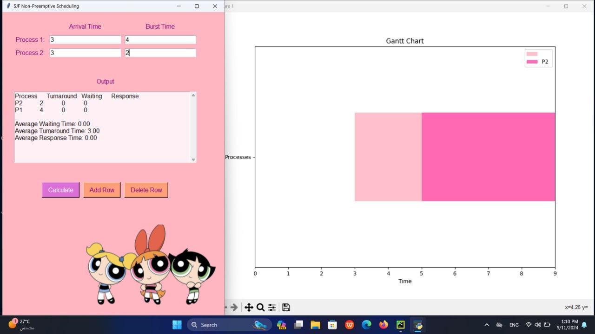

# 🌸 SJF Non-Preemptive Scheduling Simulator – Kid-Friendly UI

This is a Python-based GUI application that visually demonstrates **Shortest Job First (SJF) Non-Preemptive Scheduling**, designed with a playful, girly theme to make learning fun and engaging.



## ✨ Features
- 📌 User enters the number of processes.
- ⌛ Input Arrival and Burst times for each process.
- ⚡ Calculates:
  - Waiting Time
  - Turnaround Time
  - Response Time
- 📊 Displays a colorful **Gantt Chart** using `matplotlib`.
- ➕ Add/Delete process rows dynamically.
- 🎀 Beautiful **pink-themed UI** built with `Tkinter`.

## 🛠️ Tech Stack
- Python 3
- Tkinter for GUI
- Matplotlib for Gantt chart

## 🎯 Educational Goal
This app was created to help students and kids **visually understand CPU scheduling concepts** in Operating Systems, using an intuitive and engaging interface.

---

## 💡 Run It
Make sure you have the required libraries:

```bash
pip install matplotlib
